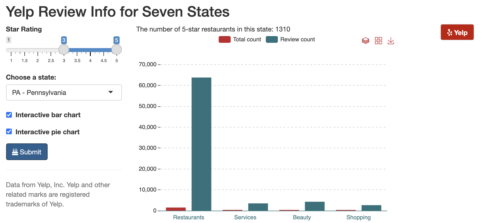

### Project 1: Yelp review info for seven states

Dashboard: [link](https://gemeixli.shinyapps.io/shinyy/)

- This is an interactive dashboard where user can select the star rating and location (seven states) to visualize Yelp review info.

<!--  -->

### Project 2: Text mining
[link](https://github.com/Gemeiii/text-mining)

-	A comparison of the work from Mark Twain, Leo Tolstoy and Charles Dickens, and find which two authors are more alike.
-	Discover how sentiment changes in Victor Hugo’s Les Miserables and Charles Dickens’ A Tale of Two Cities.  

### Project 3: Machine learning project
[link](https://github.com/Gemeiii/Machine-learning-project)

- This project used a wine dataset to see which chemicals were important in predicting the quality of wine using multiple methods. - These methods include knn, tree, logistic regression(ordinal), lasso, and linear regression.

